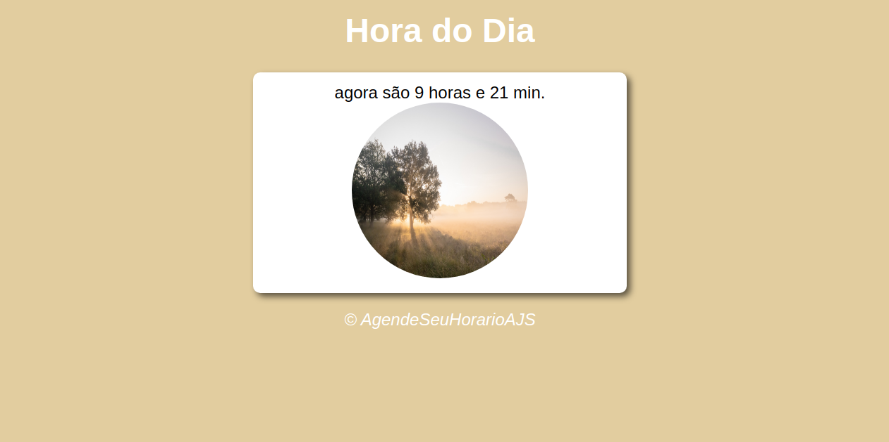
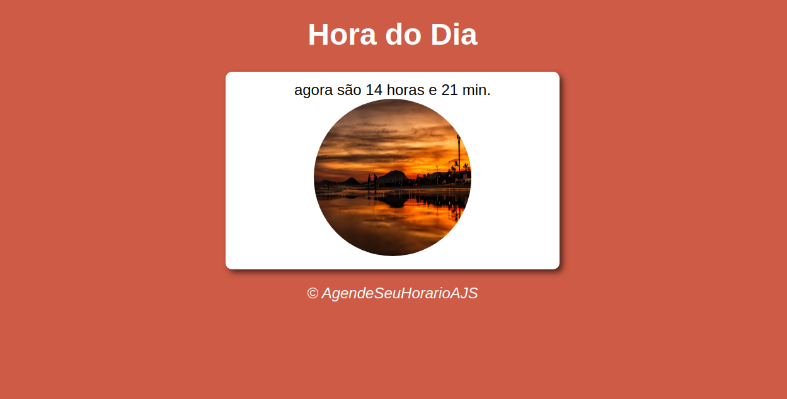
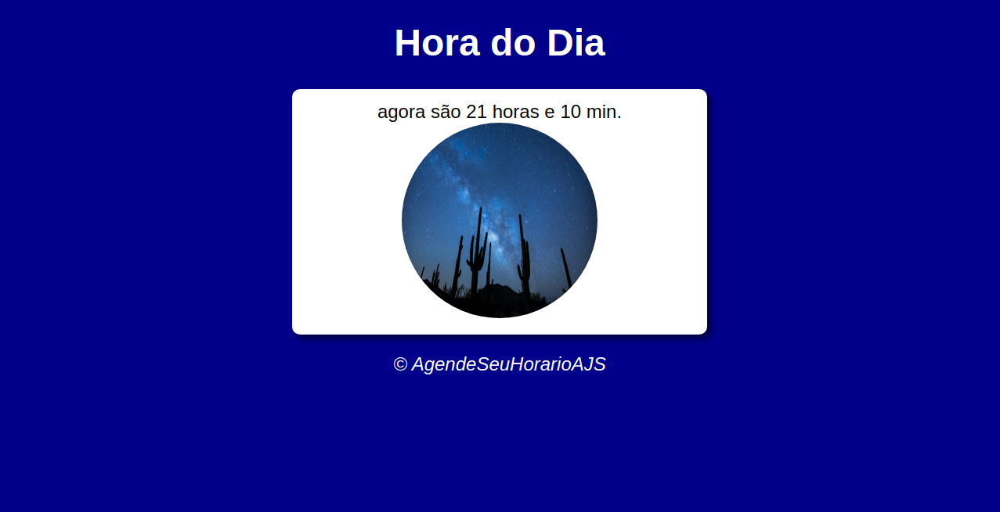
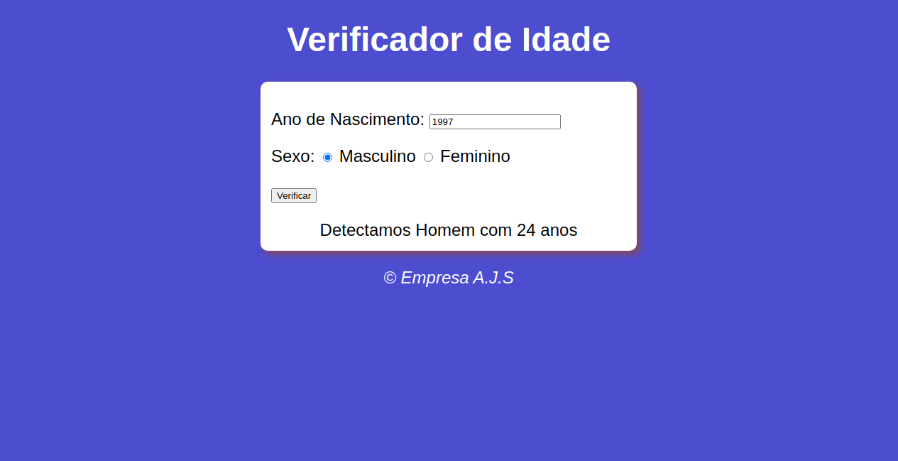

# javaScript
> javaScript é uma linguagem muito utilizada para o desenvolvimento de sistemas,que permite a você implementar itens complexos em páginas web.
## linguagem
> linguagem de programção: javaScript
>
>  linguagem de marcação de texto: HTML
>  
>   linguagem de design gráfico: CSS

## O que foi aprendido
> Nesse documento foi aprendido declaração de variável, uma estrutura de repetição, estrutura de decisão, estrutura de dados indexada, o uso do DOM com js e entre outros assuntos abordados.
## web-site
> Ao final pode-se fazer alguma aplicação do que foi aprendido, com dois web sites.

> O primeiro web site, é um sistema que com a hora do computador que esta hospedado, indica uma foto para cada turno com hora e minuto. Segue o exemplo abaixo.

 

  
 
 
 

 
 > O segundo é um verificador de idade, coloca o ano que nasceu e o sexo, logo após tem o resultado do sexo escolhido e idade. Segue abaixo o exemplo.
 

  
 

 
## Como testar
> para o teste é preciso.
- baixar o um  ambiente de desenvolvimento, preferível o Visual Studio Code;
- navegador de internet.

